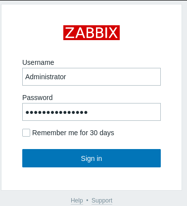

# Zabbix 5.0.17 - RCE (Authenticated) - By Hand

# Step by Step PoC

1. Login with correct credentials. 

2. Click at Hosts on the left dropdown menu.
    
    Info: You can see the current Zabbix Version in the right corner. 
    

3. Now do a left click on a Host and select “*Configuration”.*

4. Select “*Items”* from the top Menu. 

5. Click “*Create Item”* on the right corner.
    
    Info: You can also try to open this site with this URL: http://monitoring.shibboleth.htb/items.php
    

6. Write in the input field from “*Key*”: `system.run[<Command>]` and click at the button “*Test*”.

7. In the popup, click “*Get value and test*” and now you see your command output in the output field from “*Value*”.

